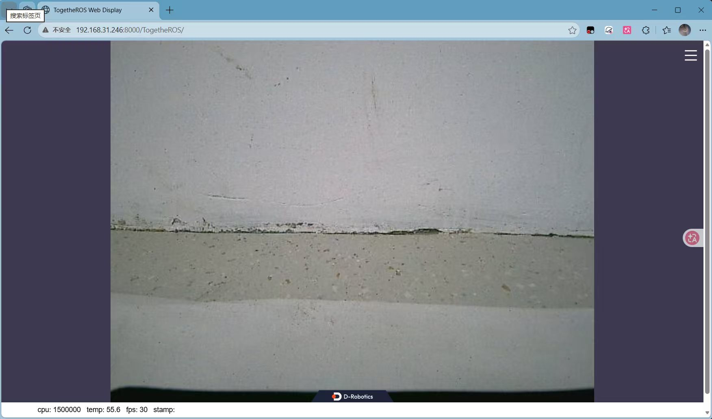
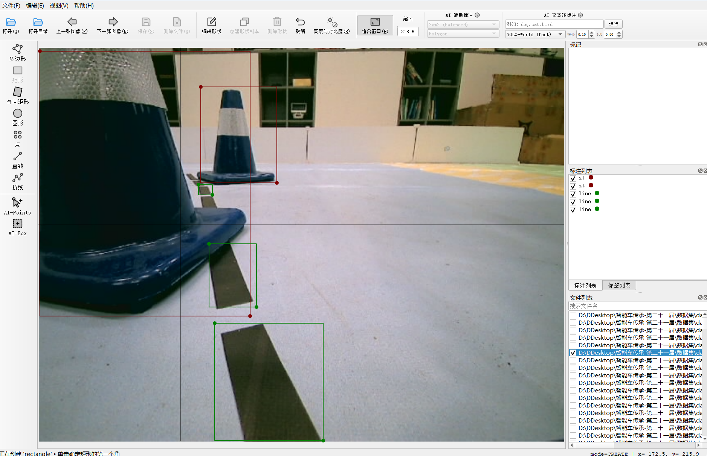
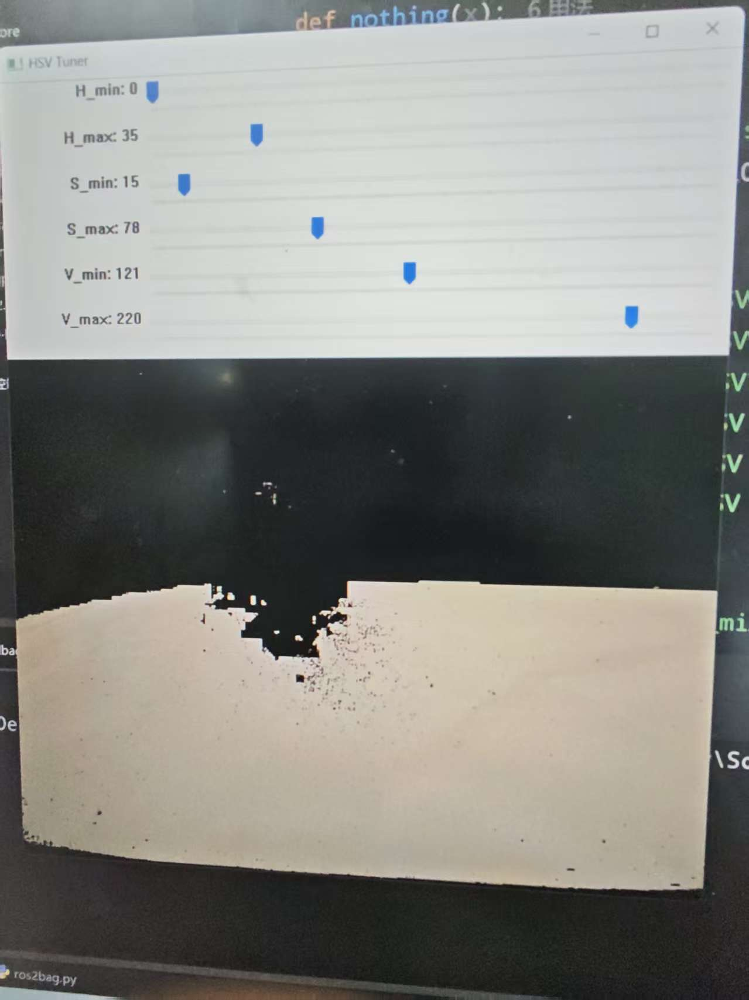

# 智能车赛队技术传承文档

## 1. 历届比赛概述

### 1.1 2026 第二十一届赛季概述

#### 1.1.1 赛题概述与资料入口

2026 年第二十一届智能汽车竞赛地瓜机器人创意组挑战赛围绕“智慧医疗”主题，要求车辆在 180 秒内，从 P 点出发，依次完成二维码任务获取、黄色通道行驶及人形立牌的大模型图生文识别，最终返回 P 点，按完成时间排名。本队采用车载屏幕展示二维码信息及图文识别结果。

比赛规则、地图、报名信息及入门资料通过以下入口查阅：

- **[智能车竞赛入门专栏](https://origincar.guyuehome.com/)**：查阅比赛背景、规则、地图及入门介绍，参赛前重点阅读。
- **[古月居官网](https://www.guyuehome.com/)**：在“活动/竞赛”模块查找报名通道及官方 QQ 群；同时关注“古月居”微信公众号，以便及时获取赛事通知。
- **[地瓜机器人开发者社区](https://forum.d-robotics.cc/)**：检索开发板使用、环境配置、模型部署等问题及解答，遇到问题时可优先搜索。
- **[CSDN](https://www.csdn.net/)**：参考其他队伍或开发者分享的智能车实践经验，使用时注意文章对应的年份、硬件及软件版本。

规则与地图以当年官方发布版本及补充通知为准。建议每年在本节补充当届规则、地图的具体链接，避免网站更新后难以查找历史资料。

#### 1.1.2 比赛车辆硬件配置

本队采用官方 OriginCar（小粉）作为比赛平台，主要硬件配置如下：

| 硬件 | 本队配置 | 用途 |
| --- | --- | --- |
| 车辆平台 | OriginCar（小粉） | 车辆运动与底层控制 |
| 主控板 | RDK X5，8GB 内存 | 运行视觉模型、ROS2 节点及任务控制程序 |
| 相机 | 单目相机 | 采集赛道图像，完成循迹、目标检测及图文识别 |
| 车载屏幕 | 香橙派 5 寸无触摸 HDMI 屏 | 展示二维码任务信息及图文识别结果 |

**选型经验：** 建议使用 8GB 版本的 RDK X5。根据本队使用经验，4GB 版本长时间运行时容易出现卡顿，不利于比赛中的持续稳定运行。选购车辆时注意区分 OriginCar（小粉）与 OriginCar Pro（小橙），后者还配备深度相机，相关配置和教程需对应具体车型。

#### 1.1.3 当年最终成绩与任务完成情况

本赛季车辆已实现二维码任务获取、黄色通道行驶与图文识别、返回 P 点停车的完整任务流程，采用车载屏幕展示识别结果。

| 项目 | 成绩 |
| --- | --- |
| 日常训练全任务最快用时 | 27.9 秒 |
| 安徽省赛最终成绩 | 38.22 秒，比赛过程中碰撞一次锥桶 |
| 安徽省赛排名 | 170 支队伍中第 36 名 |
| 获奖情况 | 安徽赛区二等奖 |

训练成绩反映了终版方案的速度潜力，省赛表现也说明车辆在实际比赛中的避障稳定性仍有提升空间。

#### 1.1.4 终版方案系统架构与节点分工

系统基于 ROS2 多节点架构运行，通过单目相机采集图像，由视觉感知模块提取目标位置和道路引导点，控制模块根据当前任务生成车辆运动指令，同时完成二维码解码、图文理解及屏幕显示。

##### 主要模块与分工

| 模块 | 主要节点或功能包 | 职责 |
| --- | --- | --- |
| 图像采集与处理 | `hobot_usb_cam`、`hobot_codec` | 采集相机图像并转换格式，供模型推理、二维码识别和画面显示使用 |
| 目标检测 | `racing_obstacle_detection_yolo` | 使用统一 YOLO 模型检测黑线、P 点、图文立牌、二维码和锥桶五类目标 |
| 道路引导点预测 | `racing_track_detection_resnet_*` | 使用 ResNet 回归道路引导点，为黑线及黄色通道循迹提供依据 |
| 循迹控制 | `control_resnet` | 根据引导点位置计算循迹指令，并管理不同路段的循迹模式 |
| 目标追踪与避障 | `control_yolo` | 根据检测结果完成二维码追踪、P 点追踪与停车、锥桶避障等动作 |
| 总控制 | `control_master` | 协调循迹、追踪、避障及图文抓拍等任务，选择并发布最终运动指令 |
| 二维码解码 | `qrcode` | 解析二维码内容，发布任务信息，供后续任务选择和显示使用 |
| 图文理解 | `vision_language_model` | 根据控制信号抓取并裁剪立牌图像，调用视觉语言模型生成文字描述 |
| 屏幕显示 | `screen_text_display` | 显示二维码任务信息及图文识别结果 |
| 底盘通信 | `origincar_base` | 接收运动指令并与车辆底层控制器通信 |

##### 控制指令如何汇合

`control_resnet` 将循迹指令发布到 `/cmd_vel_resnet`，`control_yolo` 将追踪与避障指令发布到 `/cmd_vel_yolo`。`control_master` 根据任务阶段、检测结果及指令是否超时进行协调，最终通过 `/cmd_vel` 向底盘发送运动指令。

代码通过节点内部的模式变量、状态变量和切换条件管理任务，例如二维码追踪、停车、黄色通道行驶和图文抓拍。这属于状态机式任务控制，没有使用独立的状态机框架。

##### 阅读代码的建议顺序

先阅读 `control_master.py`，了解任务之间如何衔接；再阅读 `control_resnet.py` 和 `control_yolo.py`，理解循迹、追踪和避障如何产生控制指令；最后根据需要查看模型推理、二维码解码与图文理解模块。

#### 1.1.5 软件环境与部署方式

本队采用“电脑端修改代码、车端编译运行”的开发方式。首次部署直接复制完整源码，后续可结合 Syncthing 与 AI 辅助开发持续迭代。

##### 主要环境

| 项目 | 本队使用方式 |
| --- | --- |
| ROS2 运行环境 | TROS Humble |
| 车端工作空间 | `/root/dev_ws` |
| 源代码目录 | `/root/dev_ws/src` |
| 编译工具 | `colcon` |
| 电脑与车端连接 | SSH |
| 视觉模型部署 | 适配 RDK X5 的 `.bin` 模型及对应配置文件 |
| 图文理解接口 | 火山方舟视觉语言模型接口，需配置网络与 API 密钥 |

##### 首次部署

在已配置好系统、TROS 和项目依赖的车辆上，直接采用复制粘贴的方式部署：

1. 在车端 `/root` 目录下创建工作空间文件夹 `dev_ws`。
2. 找到传承资料中的 `智能车传承-第二十一届\历届代码\第二十一届参赛代码-斛兵智行\src`，将整个 `src` 文件夹复制到车端 `dev_ws` 下。复制后的源码路径应为 `/root/dev_ws/src`。
3. 打开车端终端，进入工作空间，加载 TROS 环境并编译：

```bash
cd /root/dev_ws
source /opt/tros/humble/setup.bash
colcon build
source install/setup.bash
```

编译完成后，按照下一节的命令启动相关节点。当前部分配置使用 `/root/dev_ws` 下的绝对路径，建议首次部署保持该目录不变。

##### 后续迭代

首次部署并运行成功后，日常修改可以继续通过手动复制更新。如果需要结合 AI 辅助开发，建议使用 Syncthing 同步电脑端与车端源码，便于同时进行手动修改、AI 辅助修改和实车验证，具体配置见第四章。

每次修改后，先确认同步完成，再在车端编译并重启对应节点。仅修改部分功能包时，可单独编译相关功能包，减少等待时间。

##### 部署注意事项

- Syncthing 主要同步源码、模型和配置，不建议同步车端生成的 `build`、`install`、`log` 目录。
- 新开的车端终端需要加载 TROS 与工作空间环境。
- 大模型 API 密钥通过车端环境变量配置，不写入传承文档或上传 GitHub。

#### 1.1.6 常用启动与调试命令

以下命令均在车端终端执行。启动感知模块、控制模块及执行调试命令时，分别使用不同终端。

##### 加载运行环境

每个新终端先执行：

```bash
cd /root/dev_ws
source /opt/tros/humble/setup.bash
source install/setup.bash
```

##### 启动感知、底盘与显示模块

本项目使用火山方舟平台的豆包视觉语言模型，模型 ID 为 `doubao-seed-2-1-pro-260628`，用于将人形立牌图像转换为文字描述。该模型已在代码中设为默认值，日常启动无需重复指定。

**首次配置 API 密钥：**

在车端 `~/.bashrc` 文件末尾添加以下内容，将占位符替换为自己的密钥：

```bash
export ARK_API_KEY='替换为自己的API密钥'
```

保存后，在当前终端执行一次，使配置生效：

```bash
source ~/.bashrc
```

后续新开的交互式 Bash 终端会自动加载该配置，无需重复输入密钥。密钥仅保存在车端，不上传 GitHub。

**日常启动：**

加载运行环境后，在第一个终端执行：

```bash
ros2 launch origincar_bringup usb_websocket_display.launch.py \
  device:=/dev/video0 \
  save_tuwen_picture:=true \
  margin_tuwen:=0.15 \
  screen_display:=:0
```

该入口启动相机、图像处理、YOLO、ResNet、二维码解码、图文理解、屏幕显示及底盘通信等模块。当前代码也包含语音相关节点。

##### 启动车辆控制

确认感知模块正常后，在第二个终端加载环境并启动控制。以下仅为参数写法示例，不代表比赛终版参数；启动后车辆可能开始运动。

```bash
ros2 launch control control.launch.py \
  v_line:=0.8 v_yellow:=0.8 v_avoid:=0.6 \
  enable_track_qrcode:=1 \
  enable_force_avoid_right:=0
```

其中，`enable_track_qrcode` 控制是否启用二维码追踪，`enable_force_avoid_right` 控制是否启用返回阶段强制向右避障，`1` 为开启，`0` 为关闭。未填写的参数使用当前 launch 文件中的默认值。

##### 常用调试命令

| 用途               | 命令                                                     |
| ---------------- | ------------------------------------------------------ |
| 查看运行中的节点         | `ros2 node list`                                       |
| 查看当前话题           | `ros2 topic list`                                      |
| 查看话题发布者、订阅者及 QoS | `ros2 topic info /racing_obstacle_detection --verbose` |
| 查看目标检测消息频率       | `ros2 topic hz /racing_obstacle_detection`             |
| 查看最终运动指令         | `ros2 topic echo /cmd_vel`                             |
| 查看二维码识别结果        | `ros2 topic echo /qrcode_result`                       |
| 查看图文输出结果         | `ros2 topic echo /screen_text`                         |
| 查看循迹控制模式         | `ros2 topic echo /resnet_control_mode`                 |
| 查看追踪与避障模式        | `ros2 topic echo /yolo_mode`                           |
| 查看控制启动参数及默认值     | `ros2 launch control control.launch.py --show-args`    |

持续输出的调试命令可按 `Ctrl+C` 结束。话题频率表示该终端实际接收消息的频率，不能直接等同于模型内部推理帧率。

##### 修改后的编译与停止方式

例如，仅修改控制功能包后，在工作空间执行 `colcon build --packages-select control`，编译成功后重新加载 `source install/setup.bash`，再重启控制节点。

停止运行时，先在控制终端按 `Ctrl+C`，确认车辆停止后，再关闭感知与底盘终端。重新启动前，可通过 `ros2 node list` 检查是否存在残留或重复节点。

#### 1.1.7 赛季总结与待改进问题

本赛季在上届代码基础上完成了全任务流程，训练时基本能够稳定在 28 秒左右，最快为 27.9 秒。但赛前硬件意外导致原有调参成果难以复用，最终使用官方备用车参赛，以 38.22 秒完成比赛。这段经历也为后续队伍留下了以下经验。

##### 相机高度与角度是调参的基础

**正式调参前，务必固定并记录相机的安装高度和角度。** 相机姿态会改变道路引导点、目标框位置及目标在画面中的大小，直接影响循迹、避障、二维码追踪和停车等参数。同一套参数不能默认适用于不同的相机安装状态，相机调整后应重新验证。

建议在开始系统调参前，完成以下记录：

- 对整车进行 360° 视频拍摄，重点记录相机支架、安装位置、紧固件及线缆布置。
- 测量并记录相机安装高度、俯仰角度，在支架连接处做好位置标记，便于意外移动后恢复。
- 在电脑端打开小车相机画面，保存截图。可以前方泡沫板边缘在画面中的高度作为参照，同时记录车辆与泡沫板的距离、摆放方向，保证后续对比条件一致。
- 将安装记录、画面截图与对应的代码和参数版本一起保存。画面参照用于辅助检查，不能完全替代实际尺寸和角度记录。



上图为电脑端查看小车相机画面的示例，可参考前方泡沫板边缘在画面中的位置，检查视角是否发生变化。

本队在最后一天训练时，不慎踩到摄像头，将支架踩歪。由于此前没有记录具体安装角度和高度，无法准确恢复原有视角，导致此前半个月调试出的参数几乎全部失效。最终只能使用比赛官方备用车，现场又无法充分调试，所幸仍能完赛，其中一次仅轻蹭锥桶，最终成绩为 38.22 秒。

这次失误的关键教训是：**稳定版本不仅包括代码和参数，也包括与之匹配的硬件安装状态。** 后续应加强相机支架保护，并提前验证备用车或备用支架的恢复方案。

##### 控制架构应便于实车调试

根据本队测试经验，在任务逻辑尚未成熟、切换条件仍需频繁调整时，不建议将整个控制流程组织成严格的有限状态机（FSM）。全流程状态机容易出现“当前动作已经结束，但下一状态的进入条件未满足”的情况，表现为车辆莫名停在原地，增加定位和调试难度。

开发初期建议采用按优先级组织的 `if/elif` 多条件判断，先理清各任务的触发条件、控制优先级及默认行为。二维码追踪、避障方向保持等需要维持行为连续性的局部任务，可以使用状态机式控制，并明确退出条件、超时处理和恢复方式。

这里强调的是让整体流程直观、便于排查，而不是完全排斥状态机；`if/elif` 同样可以实现状态机，关键在于如何组织任务与切换条件。

##### 避障训练不能回避困难位置

根据本届比赛观察，主办方会在二维码和 P 点附近布置锥桶，以限制远距离提前扫码或提前识别 P 点。因此，训练不能只验证普通巡线途中的避障，还要重点覆盖二维码前、P 点前以及目标追踪过程中的避障。

不要因为某个位置的锥桶难以通过，就跳过该位置或期待正式比赛不会遇到。锥桶布置本身就是对车辆能力和稳定性的考察，应在时间允许的情况下尽可能覆盖不同位置、间距及组合：

- 二维码前存在锥桶，绕行后能否重新找到二维码并完成任务。
- P 点前存在锥桶，能否兼顾避障与最终停车位置。
- 连续两个锥桶距离较近，是否出现方向频繁切换或车辆失控。
- 返回路段采用强制向右避障时，是否仍有足够的通行空间。

对于反复失败的位置，应保留摆放照片、运行视频和对应参数，持续定位问题。评估方案时，除最快用时外，还应记录多次运行的成功率、平均用时及失败原因。

##### 后续改进重点

后续队伍应优先完善硬件安装记录、困难锥桶场景测试及稳定版本备份，再逐步提高速度。同时，继续验证不同光照下的感知效果，以及图文任务运行时的消息频率、控制延迟和资源占用，减少完整任务流程中的性能波动。

## 2. 核心任务方案与技术迭代

### 2.1 数据集整理与模型训练迭代

#### 2.1.1 2026 赛季

##### 数据集与训练资料

本届已整理并保留标注完成的数据集，存放于：

```text
智能车传承-第二十一届\数据集
```

YOLO 模型训练方法见：

```text
智能车传承-第二十一届\数据集\训练yolo模型的操作步骤（yolov8n）
```

ResNet 的训练方法可在[地瓜机器人开发者社区](https://forum.d-robotics.cc/)搜索相关教程，本资料不再重复整理。使用已有数据前，应检查类别定义、标注格式及其对应的训练方案。

##### 数据质量决定感知能力的基础

模型训练是本比赛最重要的工作之一。模型能够准确、稳定地识别目标，后续循迹、追踪和避障才有可靠依据。仅靠控制参数，很难弥补持续漏检、误检或目标位置抖动的问题。

采集数据不能只拍摄光照良好、目标完整且位于画面中央的情况，还应覆盖实际比赛中容易失败的场景：

- 不同光照亮度、阴影、反光以及不同场地背景。
- 不同距离、角度和画面位置下的锥桶、二维码、P 点及图文立牌。
- 锥桶或 P 点被遮挡、只露出一小部分，以及目标位于画面边缘的情况。
- 锥桶与二维码、P 点同时出现，以及多个锥桶距离较近的情况。
- 车辆转弯、绕障过程中出现的视角变化和运动模糊。
- 不含目标或容易被误识别的背景画面，帮助减少误检。

困难样本也需要保持标注可靠，不能为了增加数量而对无法判断的目标强行标注。采集时应保持相机安装状态与实车运行一致。



上图为标注工具中的目标检测框示例，包含 `zt`（锥桶）和 `line`（黑线）类别，可参考近距离目标及部分遮挡场景的标注方式。该图展示的是检测框标注，不是 ResNet 道路引导点标注。

##### 图像采集脚本

源码中的 `src/read_image.py` 可直接用于采集训练图片。脚本订阅 `/nv12_img`，将 NV12 图像转换后保存为 PNG，避免再次使用 JPEG 编码保存造成的有损压缩。

先按第一章启动相机及图像处理模块，再在另一个已加载 TROS 和工作空间环境的车端交互终端执行：

```bash
cd /root/dev_ws/src
python3 read_image.py
```

| 操作或配置 | 说明 |
| --- | --- |
| 按 `j` | 开始或暂停采集，启动时默认暂停 |
| 按 `Ctrl+C` | 退出脚本 |
| `SAVE_EVERY_N_FRAMES = 4` | 采集中每接收 4 帧保存一张，不是固定时间间隔 |
| `SAVE_FOLDER = "image_save"` | 保存至当前运行目录下的 `image_save` 文件夹 |
| `FILE_PREFIX = "02_"` | 图片文件名前缀，例如 `02_000000.png` |

按上述命令运行时，图片保存在 `/root/dev_ws/src/image_save`。采样间隔、保存目录及文件名前缀均可在脚本顶部修改。

**注意：脚本每次重新启动都会从零编号，沿用相同目录和前缀可能覆盖已有图片。每批采集前应更换保存目录或前缀，或先将上一批图片归档。**

##### 数据与模型的迭代方式

建议围绕实车暴露的问题持续补充数据：记录失败场景，针对性采集图片，清洗并标注，重新训练，再部署到车端验证。不要遇到漏检就只降低置信度，也不要只堆积同一路段的大量相似图片。

训练集与验证集应尽量按采集批次或场景划分，避免同一段连续画面的相邻帧分别进入两者，使验证结果过于乐观。新模型既要测试新增的困难场景，也要回测原来已经稳定的任务。

每次迭代保留对应的数据集版本、训练配置、模型文件和实车结果。以完整流程的稳定性判断改进是否有效，而不是只看训练指标或某一次试车表现。

### 2.2 黑线巡线

#### 2.2.1 2026 赛季

##### 任务与基本思路

黑线巡线用于车辆从 P 点出发后的行驶，以及驶出黄色通道后的返回路段。本赛季接手的上届代码已具备黑线巡线能力，后续主要围绕任务衔接、行驶位置调整和控制稳定性进行优化。

当前方案使用 ResNet 模型预测图像中的道路引导点。`control_resnet` 读取引导点的横坐标，计算其与设定参考位置的偏差，再根据偏差生成转向角速度。

```text
横向误差 = 设定参考横坐标 - 模型预测引导点横坐标
转向角速度 = 平滑后的横向误差 × 转向比例系数
```

这里的误差是图像中的像素偏差，不是车辆与黑线之间的实际距离。前进速度由参数设定，转向随引导点位置变化而调整。

从本队采用的单目纯视觉循迹与目标追踪方案来看，横向控制可以直观理解为：在画面中设置一条横坐标为 `x` 的参考线，利用 PID 中的比例项 `kp`，根据目标与参考线之间的误差 `error` 调整转向，使目标逐渐靠近参考线。当前实现属于带误差平滑和输出限幅的 P 控制，并未使用完整的 PID。根据本届实车经验，在模型识别稳定、相机安装固定且速度与参数匹配的条件下，这种方式已能满足本赛题的基本循迹与追踪需求，无需一开始就追求复杂的高精度控制算法。

YOLO 的 `line` 类主要用于辅助判断黄色通道出口的黑线衔接，日常黑线循迹的转向依据来自 ResNet 引导点。

##### 当前实现与主要改进

| 环节 | 实现方式 |
| --- | --- |
| 引导点预测 | `racing_track_detection_resnet_go` 发布黑线引导点 |
| 出发与返回 | `go`、`back` 两种控制模式复用同一个黑线模型，分别设置参考横坐标 |
| 小误差处理 | 误差绝对值不超过 3 像素时置零，减少细小偏差引起的频繁修正 |
| 误差平滑 | 当前误差占 0.7，上一次滤波结果占 0.3，缓解引导点抖动 |
| 转向控制 | 根据平滑误差进行比例控制，并对角速度限幅 |
| 指令输出 | 将循迹指令交给 `control_master`，由其协调循迹、追踪和避障 |

**出发与返回分别调整行驶位置。** 两个阶段可以设置不同的参考横坐标，配合各自的锥桶布置与任务需求。参考位置不一定始终取图像中心，调整后的实际行驶偏置需要通过试车确认。

**相同模型复用。** 当前出发与返回共用 `go` 模型，避免相同模型重复占用推理资源。`back` 表示返回阶段的控制模式，不代表必须单独启动一个模型节点。

**出口切换增加确认条件。** 黄色通道结束后，结合黑线检测置信度、目标位置、连续确认帧及出口允许条件，切回黑线循迹，减少提前切换。

##### 关键参数

| 参数 | 作用 |
| --- | --- |
| `v_line` | 黑线循迹阶段的前进速度 |
| `kp_line` | 横向误差对应的转向强度 |
| `x_line_go` | 出发阶段的参考横坐标 |
| `x_line_back` | 返回阶段的参考横坐标 |

以上参数依赖相机高度、角度及模型预测效果，更换车辆或调整相机后，需要重新验证。

##### 调试顺序与经验

先固定相机安装状态，检查模型引导点是否能稳定跟随道路，再进行控制调参。若引导点持续预测错误，应先排查图像、数据集和模型，避免仅靠控制参数补偿。

在较低速度下，先调整参考横坐标，使行驶位置合理；再调整 `kp_line`，观察转向是否及时、是否出现左右摆动；最后逐步提高 `v_line`，每次提速后重新验证直线和弯道表现。

遇到左右摆动，应区分是引导点抖动、转向系数过大，还是车速与转向响应不匹配。遇到持续偏向一侧，应同时检查相机姿态、参考横坐标和底盘转向中位。

单独巡线稳定后，还需测试避障结束后的恢复、二维码追踪介入，以及黄色通道返回时的衔接。每次记录参数时，应注明对应的相机安装状态、模型版本和测试场景。

### 2.3 锥桶识别与避障

#### 2.3.1 2026 赛季

##### 任务与基本思路

锥桶避障需要与黑线循迹、二维码追踪和 P 点追踪配合。目标不仅是绕过锥桶，还要在绕行后继续找到道路或任务目标，避免因避障偏离过大而驶出地图。

当前方案通过统一 YOLO 模型识别 `zt` 类锥桶，由 `control_yolo` 根据检测框位置判断是否触发避障、选择绕行方向并生成控制指令，再交给 `control_master` 协调执行。

##### 避障触发与方向选择

代码先筛选满足置信度和画面位置要求的锥桶，存在多个候选框时，选择面积最大的一个作为当前避障目标。该方法没有计算真实距离，不能直接等同于选中了物理距离最近的锥桶。

当锥桶检测框底部纵坐标达到 `y_zt` 时，触发避障。该阈值依赖相机安装状态：在相同视角下，调小通常意味着更早避障，调大通常意味着更靠近后才避障。

每次需要重新选择避障方向时，按以下顺序判断：

1. 已开启强制右避，且处于 `back` 返回模式时，选择向右绕行。
2. 当前存在已确认的 P 点时，根据 P 点与锥桶的左右关系选择方向。
3. 当前存在已确认的二维码时，根据二维码与锥桶的左右关系选择方向。
4. 没有上述目标作为参照时，根据锥桶横坐标与 `x_avoid` 的关系选择方向。

选定方向后，根据锥桶位置计算避障误差，经平滑处理、比例控制和角速度限幅，生成绕行指令。左右绕行分别使用画面右边缘或左边缘作为误差计算参照；`x_avoid` 主要用于无任务目标参照时的方向判断。

##### 主要问题与改进

**连续锥桶导致方向频繁变化。** 两个锥桶距离较近时，当前选中的检测框可能发生变化，逐帧重新决定方向容易形成左右反复切换的 S 形避障。本队加入方向保持机制：选定方向后，在连续避障过程中保持若干帧，再重新判断，减少控制跳变。

当前 `frame_avoid` 控制上述保持周期，不是锥桶触发前的连续检测确认帧数。当锥桶不再满足避障条件时，代码会清空避障方向状态，因此它也不是“一次绕障全程锁定同一方向”。

**绕障后丢失任务目标。** 追踪二维码或 P 点时，绕行可能使目标离开视野。代码保留已锁定的追踪目标，避障条件解除后继续追踪；目标仍不可见时，进入对应的丢失恢复逻辑。具体机制在二维码和 P 点任务小节中展开。

**返回路段需要定向绕行。** 针对部分锥桶布置，增加返回阶段强制向右避障开关，便于赛场调整。该策略依赖右侧通行空间，不能默认适用于所有地图布置。

##### 关键参数

| 参数 | 作用 |
| --- | --- |
| `confi_zt` | 锥桶检测置信度阈值 |
| `y_zt` | 锥桶检测框底部达到该纵坐标后触发避障 |
| `v_avoid` | 避障时的前进速度 |
| `kp_avoid` | 避障转向比例系数 |
| `x_avoid` | 无有效任务目标参照时，选择绕行方向的横坐标分界 |
| `frame_avoid` | 连续避障过程中，同一方向的保持帧数 |
| `enable_force_avoid_right` | 是否在返回模式下强制向右避障，`1` 开启、`0` 关闭 |

方向保持按收到的检测消息计数，实际持续时间受消息频率影响。保持过短可能频繁换向，过长则可能影响对后续障碍物的响应，需要结合车速和锥桶间距验证。

##### 调试顺序与经验

先确认锥桶识别稳定，再在较低速度下调整 `y_zt`，使车辆有足够的绕行空间；随后调整 `kp_avoid` 和 `v_avoid`，最后通过连续锥桶场景验证方向保持效果。

训练应覆盖二维码前、P 点前、返回路段和近距离连续锥桶，不能只测试容易通过的位置。尤其要观察绕障后能否恢复原任务，而不是只看车身是否碰到锥桶。

当前节点先处理已停车状态及满足停车条件的目标，再判断锥桶避障。因此，二维码或 P 点前有锥桶时，还需检查停车阈值是否过早触发，不能认为避障在所有情况下都具有最高优先级。

对失败场景保留锥桶位置照片、车辆运行视频和对应参数，分别判断问题来自漏检、触发过晚、方向选择、转向强度，还是绕行后的任务恢复，再进行针对性修改。

##### 后续改进建议

以下为本届调试后提出的改进方向，尚未完成实车验证，供后续队伍参考。

**增加避障后的短时反打恢复。** 在未锁定二维码或 P 点的普通巡线阶段，可尝试在避障结束后增加小幅、短时的反向转向，帮助车辆重新朝向道路，再恢复循迹。反打幅度、速度和持续时间需要实车确定，期间仍应检测障碍物与任务目标，避免反打过度或影响下一项任务。没有车身航向反馈时，这种方式只能辅助恢复，不能保证准确回正。

**补充锥桶遮挡 P 点的数据。** 针对锥桶紧靠 P 点、P 点仅部分露出的情况，增加不同距离、角度和遮挡程度的训练图片，提高模型在不完整目标下的识别稳定性。补充数据后，应重点验证绕障期间能否持续识别 P 点，以及绕行后能否正确停车，同时关注误检和提前停车问题。

**探索深度相机或激光雷达辅助避障。** 如果实验室条件允许，且当届规则允许，可考虑使用配备深度相机的 OriginCar Pro（小橙），或探索加装激光雷达，通过距离信息辅助判断障碍物位置，研究更合理的避障触发时机，减少对图像纵坐标阈值的依赖。

本队未对深度相机或激光雷达方案进行系统学习与实车验证，这两条路线仅作为探索建议。后续队员需要自行查找官方文档和开发者社区资料，学习设备接入、标定、数据处理及其与现有控制程序的配合方式，再判断是否适合比赛使用。

### 2.4 二维码识别与追踪

#### 2.4.1 2026 赛季

##### 任务与基本思路

车辆从 P 点出发后，需要前往二维码任务发布点，读取并展示任务信息，再根据任务要求进入黄色通道。本队在已有循迹扫码功能上尝试增加二维码追踪，希望在目标可见时直接朝二维码行驶，缩短任务用时。

**训练与比赛准备应以正常巡黑线接近二维码为主。** 根据本队参赛观察，官方为限制远距离提前扫码，通常会在二维码前布置锥桶，遮挡二维码。在这种情况下，追踪目标容易间歇出现或在绕障时丢失，二维码追踪模式的稳定性不足，不宜作为主要比赛方案。

建议优先使用 `enable_track_qrcode:=0`，完成巡黑线、锥桶避障、二维码到位停车与解码的完整流程。关闭追踪仅表示不主动朝二维码目标行驶，不会关闭二维码检测和解码。

二维码追踪可作为一种扩展思路保留，供后续队员学习目标追踪、局部状态保持和丢失恢复。在二维码前没有锥桶遮挡、目标持续可见且规则允许的场景下，再通过实车测试判断是否启用，不应仅凭无遮挡训练中的速度优势选择该方案。

##### 模块分工

二维码定位与内容读取由不同模块完成：

| 模块 | 职责 |
| --- | --- |
| YOLO 的 `qrcode` 类 | 检测二维码位置，提供追踪及停车判断所需的检测框 |
| `qrcode` 节点 | 读取相机图像，使用 ZBar 解码并发布任务内容 |
| `control_yolo` | 完成目标确认、追踪、停车及目标丢失恢复 |
| `control_master` | 等待任务编号与到位状态，执行二维码阶段的后续动作 |
| `screen_text_display` | 展示二维码任务信息 |

当前解码节点直接使用 NV12 图像的亮度通道进行识别，不依赖 YOLO 检测框裁剪。因此，“已经读到二维码内容”与“车辆已经到达二维码前”是两个独立条件。

##### 识别、追踪与任务切换

以下流程中的主动追踪仅在开启追踪开关时使用；关闭追踪时，车辆沿黑线接近目标，仍需完成检测确认、到位停车和任务切换。

1. **确认目标。** YOLO 检测到满足置信度和位置筛选要求的二维码，连续达到 `frame_qrcode` 次后，在无其他目标锁定且二维码任务尚未完成时，允许锁定二维码追踪。
2. **朝目标行驶。** 计算二维码框中心横坐标与 `x_qrcode` 的偏差，经过误差平滑和比例控制生成转向指令。
3. **到位停车。** 二维码框底部纵坐标达到 `y_qrcode` 后，进入 `stop_qrcode` 状态。
4. **等待两个条件齐备。** 总控同时确认有效任务编号和 `stop_qrcode` 状态后，才启动后续动作，避免远距离提前解码就直接切换任务。
5. **进入黄色通道。** 完成设定的短暂停车与转向避让动作后，发布 `/qrcode_action_done`，通知控制节点进入对应的黄色通道模式。

当前代码将顺时针任务映射为编号 `3`，逆时针任务映射为编号 `4`；支持 `ClockWise`、`AntiClockWise` 以及数字任务内容，数字按奇数顺时针、偶数逆时针转换。后续赛季应根据当年规则核对这一映射。

##### 主要问题与改进

**追踪与巡线反复切换。** 初期测试中，检测不稳定容易造成车辆一会追踪二维码、一会恢复巡线，引起控制跳变。后续加入局部目标锁定和模式保持，短暂丢失二维码时继续执行追踪恢复逻辑，不立即回落到巡线。

**远距离或误检测导致停车。** 通过调整二维码检测置信度、增加连续帧确认，并结合检测框底部位置判断到位，减少误触发。连续帧确认针对的是视觉目标，不等于对解码内容进行了多帧一致性校验。

**避障途中丢失二维码。** 锥桶绕行可能使二维码离开视野。当前实现先保留最近一次有效追踪转向；持续丢失超过设定帧数后，以该转向的反方向寻找目标，丢失进一步延长时再降低恢复速度。

这里的反打参考是“最近一次有效二维码追踪转向”，不是直接取最后一次锥桶避障转向。参数名中的 `reverse` 表示反打方向，当前代码中的恢复前进速度仍为非负值，不代表倒车。

**保留现场策略开关。** `enable_track_qrcode=1` 时启用追踪；设为 `0` 时沿用黑线循迹接近二维码，但仍保留二维码检测、到位停车与任务解码，方便根据场地情况选择方案。

##### 关键参数

| 参数 | 作用 |
| --- | --- |
| `enable_track_qrcode` | 是否开启二维码追踪 |
| `confi_qrcode`、`frame_qrcode` | 目标检测置信度与连续确认次数 |
| `x_qrcode`、`kp_qrcode` | 追踪参考横坐标与转向比例系数 |
| `v_qrcode`、`y_qrcode` | 追踪速度与到位停车阈值 |
| `frame_lost_qrcode` | 丢失后保持原追踪转向的计数阈值 |
| `frame_lost_slow_qrcode` | 持续丢失后切换到较低反打速度的计数阈值 |
| `v_qrcode_lost` | 短暂丢失阶段的前进速度 |
| `v_qrcode_reverse`、`v_qrcode_reverse_slow` | 反打寻找阶段及进一步降速阶段的前进速度 |
| `time_out_yolo` | 总控判断 YOLO 控制指令是否过期的时间阈值 |

##### 调试经验与注意事项

先以关闭追踪的方式练稳巡黑线、避障、到位停车与解码的完整流程，重点覆盖二维码前有锥桶遮挡的情况；再在无遮挡等适用场景下单独测试追踪方案，比较其速度和成功率。还需检查远距离提前读码、局部遮挡、绕障后目标丢失，以及到位后暂时无法解码等情况。

目标丢失帧数按收到的检测消息计数，不应固定换算成秒。如果检测消息本身中断，丢失计数不会继续增加；此时由总控的指令超时机制处理。当前追踪锁定期间，控制指令超时会停车，不会直接切回巡线。

反打恢复依赖历史转向，并不能保证一定找回二维码。后续可增加恢复时限及失败处理，避免目标持续不可见时长时间盲目行驶。评估追踪方案时，应同时比较全程用时与成功率，而不是只判断是否比巡线更快。

### 2.5 黄色环形通道循迹

#### 2.5.1 2026 赛季

##### 任务与方案选择

车辆完成二维码阶段后，需要按照任务指定的顺时针或逆时针方向通过黄色环形通道，并在途中完成图文识别，最终驶出通道、恢复黑线循迹。

黄色通道是本赛季主要新增的任务之一。初期通过查阅资料、与 AI 及其他参赛队员交流，选择尝试 OpenCV 颜色分割方案；在多轮实车测试后，改用 ResNet 引导点回归方案。

##### 初始方案：HSV 分割与边界拟合

首先将相机图像转换到 HSV 色彩空间，通过颜色阈值提取黄色区域，得到二值掩膜，再利用最小二乘法拟合道路边界。在选定图像行上，计算拟合边界与预设参考位置之间的横向偏差，将其作为转向控制依据。

这里的 HSV 处理是颜色分割，不是简单地将照片灰度化。

本队测试中，该方案最高稳定车速约为 0.5 m/s，主要遇到以下问题：

- **对光照变化敏感。** 场地亮度、阴影和反光变化会影响颜色分割结果，进而干扰边界拟合。
- **急弯转向滞后。** 在部分 90° 弯道中，车辆接近甚至驶出通道边界后，选定图像行上的误差才明显增大，导致转向来不及。
- **参数难以兼顾不同路段。** 单纯增加转向系数，不能解决前方道路信息提取不足的问题，还可能使其他路段出现摆动。

上述结果反映的是本队当时这套实现的局限，并不意味着所有传统视觉方案都无法完成任务。它也说明：控制效果不仅取决于 `kp`，还取决于感知结果能否及时反映前方道路变化。

**赛道配色也是选择视觉方案时需要考虑的因素。** 根据本队对其他组别赛道的观察，部分赛道采用白色道路与深蓝色外围，明暗差异较明显，灰度化、二值化后较容易分离道路与背景，再使用最长白列法或八邻域边界跟踪等方法提取行驶依据。

相比之下，本赛题为黄色通道与较浅的绿色外围。两者虽然颜色不同，但在本队测试的光照和相机曝光条件下，灰度差异不够稳定；采用 HSV 颜色分割后，也仍会受到光照变化和反光干扰，影响边界提取。因此，不能直接照搬其他组别的图像处理参数和方案，应先检查本赛道在实际相机画面中的可分辨程度，再决定使用传统视觉还是学习型模型。



上图展示本队调试时的 HSV 阈值调节界面及对应分割结果，可见区域缺口和散点干扰。虽然文件名为“灰度处理不适用原因”，图中实际展示的是 HSV 分割实验，用于记录当时的分割效果，不代表所有灰度或传统视觉方案都不可用。

##### 改进方案：ResNet 引导点回归

初次尝试表明，利用图像中的道路引导位置控制车辆具有可行性。随后，本队采集黄色通道图像，标注通道中心引导点，训练 ResNet 回归模型，以预测引导点替代手工颜色阈值与边界拟合结果。

控制部分继续采用横向误差的比例控制：

```text
横向误差 = x_yellow - 预测引导点横坐标
转向角速度 = 平滑后的横向误差 × kp_yellow
```

经过数据补充、模型训练及实车调参，本队黄色通道稳定车速由约 0.5 m/s 提升至约 0.9 m/s。模型方案减少了对手工颜色阈值的依赖，但仍需覆盖不同光照、弯道视角及相机安装条件，不能认为使用神经网络后就不再受环境影响。

##### 顺逆时针与通道衔接

| 阶段 | 当前实现 |
| --- | --- |
| 顺时针任务 | 二维码任务编号为 `3`，使用 `s` 模式及对应 ResNet 模型 |
| 逆时针任务 | 二维码任务编号为 `4`，使用 `n` 模式及对应 ResNet 模型 |
| 模型启用 | 通过 `/resnet_mode` 控制各 ResNet 节点是否处理图像进行推理 |
| 进入通道 | 二维码后续动作完成后切换模式，总控确认对应循迹指令就绪，再接管行驶 |
| 驶出通道 | 满足出口允许条件、时间条件和连续黑线检测条件后，切换到 `back` 模式 |

模式切换时，不能只修改模式名称，还要处理原有指令缓存和新模型输出之间的衔接。当前总控会清空旧循迹指令缓存，等待对应模式连续输出达到确认条件，并通过速度与转向过渡减少控制跳变。

##### 关键参数

| 参数 | 作用 |
| --- | --- |
| `v_yellow` | 黄色通道循迹速度 |
| `kp_yellow` | 黄色通道转向比例系数 |
| `x_yellow` | 黄色通道参考横坐标 |
| `frame_resnet_ready` | 对应模式循迹指令就绪所需的连续确认次数 |
| `time_change_yellow_in` | 黄色通道控制接管时的过渡时间 |
| `time_out_resnet` | 循迹控制指令的有效时间阈值 |
| `time_line` | 从本节点首次缓存有效二维码任务起，允许出口判断前的最短等待时间 |
| `confi_line`、`frame_line`、`y_line` | 出口黑线检测的置信度、连续确认次数及位置阈值 |

出口判断还受总控发布的允许信号约束，不是经过 `time_line` 后看到黑线就一定切换。

##### 调试经验

先分别验证顺时针和逆时针模型的引导点预测，再在较低速度下检查参考位置与转向响应，最后逐步提速。急弯失败时，应先看模型是否提前给出了合理引导点，再判断是车速过高、转向不足还是控制延迟。

数据采集应覆盖入弯前、弯中、出弯及通道进出口，不能只保留容易跑通的路段。标注应保持一致的引导点选取原则，避免相似画面中的标注位置忽远忽近，造成预测与转向抖动。

完整测试还应包含二维码动作后的模型接管、图文抓拍前后的速度变化，以及驶出黄色通道后的黑线恢复。单独绕通道稳定，不代表加入全部任务后仍能保持相同表现。

### 2.6 图文识别与结果输出

#### 2.6.1 2026 赛季

##### 任务与基本思路

车辆在黄色通道内识别人形立牌，采集立牌图像，通过视觉语言模型生成简短文字描述，并在车载屏幕上展示。

当前方案分为两个环节：统一 YOLO 模型中的 `tuWen` 类负责定位立牌，视觉语言模型负责理解图片内容。YOLO 检测到立牌，不代表已经完成图文理解。

图文模型通过火山方舟接口调用，具体模型与密钥配置见第一章。

##### 主要执行流程

1. **判断触发时机。** 二维码阶段动作完成、黄色通道控制就绪，且满足 `time_tuwen` 时间条件后，才允许触发图文抓拍。
2. **连续确认立牌。** 检测框满足置信度、面积和底部位置要求，并连续达到 `frame_tuwen` 次后，进入抓拍流程。
3. **调整车速并等待稳定。** 将速度过渡至 `v_tuwen`，等待 `delay_tuwen` 后，通过 `/get_picture` 发出抓拍请求。`v_tuwen=0` 表示停车抓拍，也可测试低速抓拍。
4. **获取并裁剪图片。** 图文节点收到请求后获取下一帧 NV12 图像，根据立牌检测框及扩展边距裁剪，编码为 JPEG 并保存。
5. **恢复循迹并后台识别。** 图文节点发布 `/tuwen_picture_path`，总控收到保存成功通知后开始恢复循迹；模型请求在后台线程中执行。
6. **显示结果。** 模型返回文字后，通过 `/screen_text` 等话题发布，由屏幕节点展示。

当前裁剪框不可用时会退回使用整张图片。调试时应检查真正发给模型的图片，避免误把背景过多或裁剪错误的问题归因于模型能力。

##### 图文标识牌案例资源

本队保留了以下案例，可用于理解任务内容和测试图像输入。下表说明为人工概括，不是当时模型的实际输出记录。

| 案例 | 图片内容概括 |
| --- | --- |
| [图文标识牌案例1](./传承文件对应说明图片/图文标识牌案例1.jpg) | 戴红帽的人物坐在病床上看手机 |
| [图文标识牌案例2](./传承文件对应说明图片/图文标识牌案例2.jpg) | 人物闭眼躺在病床上休息 |
| [图文标识牌案例3](./传承文件对应说明图片/图文标识牌案例3.jpg) | 人物躺在病床上，手臂连接管线 |

描述应围绕图片中可见的人物、动作和场景，不凭空补充病名、病情等信息。当前默认提示词为：“请用一句简短中文描述图中医院场景下的人物立牌内容。”

##### 主要设计与调试经验

**选择合适的抓拍位置。** 过早抓拍可能导致立牌过小、视角过斜；过晚则可能出现目标出框。需要结合车速、相机角度和立牌位置调整触发条件。`time_tuwen` 是时间限制，不是真实位置判断，车速变化后也需要重新验证。

**抓拍与网络请求分开。** 保存图片后恢复行驶，有助于减少等待用时，但不等于图文任务已经成功完成。必须进一步确认模型返回了有效描述，而且结果确实显示在屏幕上。

**区分本地处理与云端推理。** 本地负责检测、抓图、裁剪和编码，视觉语言模型通过网络调用。运行变慢时，应分别检查本地算力与消息频率、网络耗时和模型响应时间，不能统一归因于 BPU 不足。

**异常后继续行驶，不代表任务完成。** 当前总控等待图片保存超时后也会恢复循迹，且本次抓拍流程结束后进入 `done` 状态。抓拍失败或接口请求失败时，应检查是否需要增加有次数限制的补拍或重试机制。

##### 关键参数

| 参数 | 作用 |
| --- | --- |
| `time_tuwen` | 从总控确认二维码任务起，允许图文触发前的等待时间 |
| `confi_tuwen`、`area_tuwen`、`y_tuwen` | 检测置信度、检测框最小面积及底部位置要求 |
| `frame_tuwen` | 连续满足抓拍条件的确认次数 |
| `v_tuwen`、`delay_tuwen` | 抓拍阶段速度与稳定等待时间 |
| `time_change_tuwen_in`、`time_change_tuwen_out` | 进入抓拍和恢复循迹时的过渡时间 |
| `margin_tuwen` | 检测框裁剪扩展比例 |
| `save_tuwen_picture` | 是否保留抓拍图片，便于复盘 |
| `vlm_timeout`、`vlm_max_retries` | 模型接口请求超时与最大重试次数 |

测试建议先用保留的案例图片验证模型接口和输出，再验证实车抓拍的清晰度与裁剪范围，最后测试完整行驶流程。每次失败至少保留抓拍图片、节点日志和模型返回信息，判断问题发生在检测、抓拍、网络请求还是屏幕显示环节。

### 2.7 P 点追踪与定点停车

#### 2.7.1 2026 赛季

##### 基本思路

车辆返回大厅后，需要进入 P 点规定区域并停车。当前方案通过 YOLO 的 `p` 类定位停车标识，由 `control_yolo` 完成目标确认、追踪与到位判断。

在没有其他目标锁定时，P 点连续检测满足置信度和确认次数要求后，锁定 P 点。控制节点计算 `x_p` 与 P 点检测框中心横坐标的偏差，经平滑处理后乘以 `kp_p`，控制车辆朝 P 点行驶。

当已锁定 P 点、当前检测框有效且框底部纵坐标达到 `y_p` 时，进入 `stop_p` 状态，并发布 `/p=1`。总控随后持续输出零速度，循迹节点停止 ResNet 推理，避免停车后再次被其他运动指令带走。

##### 避障与目标丢失

尚未达到停车条件时，前方锥桶仍可触发避障；避障解除后恢复 P 点追踪。短暂丢失 P 点时，保留最近一次有效追踪转向；超过设定丢失次数后反打寻找，持续丢失则进一步降低恢复速度。该机制与二维码追踪类似，不能保证一定找回目标。

P 点停车判断位于锥桶避障判断之前，因此避障过程中也可能触发停车。锥桶紧靠 P 点时，应重点检查遮挡是否导致漏停，以及停车阈值是否造成车辆尚未进入规定区域就提前停下。相关训练与改进建议见 2.3 节。

##### 关键参数与调试

| 参数 | 作用 |
| --- | --- |
| `confi_p`、`frame_p` | P 点检测置信度与连续确认次数 |
| `x_p`、`kp_p` | 追踪参考横坐标与转向比例系数 |
| `v_p` | P 点追踪速度 |
| `y_p` | P 点检测框底部的停车触发阈值 |
| `frame_lost_p`、`frame_lost_slow_p` | 目标丢失后的转向保持与进一步降速阈值 |
| `v_p_lost`、`v_p_reverse`、`v_p_reverse_slow` | 不同目标丢失恢复阶段的前进速度 |

先在无遮挡条件下调稳追踪与停车位置，再增加锥桶遮挡和不同接近角度。`y_p` 是图像位置阈值，不是真实距离或车身入区比例，必须结合实际停车位置和规则验证；相机姿态、车速及制动响应变化后，应重新测试。

还应验证发车阶段不会误锁定 P 点：当前 P 点锁定逻辑没有单独限定必须处于 `back` 模式，不能仅因设计用途是返回停车，就认为其他阶段一定不会触发。

### 2.8 返回阶段策略

#### 2.8.1 2026 赛季

返回阶段主要是已有功能的衔接：黄色通道出口满足切换条件后进入 `back` 模式，恢复黑线循迹；途中遇到锥桶时执行避障，确认 P 点后转入追踪，最终到位停车。出口判断、黑线控制、避障和停车的具体实现分别见 2.5、2.2、2.3 和 2.7 节。

本阶段需要联合验证两个设置：`x_line_back` 决定返回巡线的参考位置，`enable_force_avoid_right` 决定是否在返回避障时强制选择右侧。二者都要结合出口姿态、锥桶位置和右侧通行空间测试，不能直接照搬出发阶段的设置，也不能默认开启强制右避就更稳定。

试车应从黄色通道内开始，完整观察“出通道、恢复巡线、绕障、找到 P 点、停车”的连续过程，避免只把车辆摆在返回黑线上测试。终点验收还需确认车身进入规定区域，并检查图文结果是否已成功输出；车辆停下不等于全部任务均已完成。

## 3. 问题排查、调参与实车经验

本章记录实际故障、已采用的处理方法及可复用的排查思路。2026 赛季部分问题未保留完整日志，以下明确区分本队经历与建议复查步骤，不将推测写成已确认原因。算法细节见第二章，常用命令见 1.1.6 节。

### 3.1 通信与启动问题

#### 3.1.1 2026 赛季：网页端收不到画面

**故障现象与处理：** 接手上届代码后，首先遇到网页端无法接收画面的问题。本队最终定位到相关 ROS2 发布端与订阅端的 QoS 不匹配，调整配置后恢复通信。

QoS 是 ROS2 对消息可靠性、队列和历史数据等行为的配置。节点已经启动、话题名称相同，并不意味着消息一定能正常传递。例如发布端仅提供 Best Effort，而订阅端要求 Reliable 时，双方可靠性要求不兼容。处理时应检查实际发布与订阅配置，而不是把所有节点统一改成同一种 QoS。

**类似问题的建议排查顺序：**

1. 查看相机节点与设备是否正常，确认不是图像源中断。
2. 沿“相机、图像格式转换、网页传输、浏览器显示”的链路逐段检查，区分没有原始图像、没有编码图像和网页连接失败。
3. 使用 `ros2 topic info <话题名> --verbose` 检查发布者、订阅者、消息类型及 QoS，确认双方确实连接到同一话题。
4. 检查网页连接地址、网络连通性，以及两端的 ROS 环境和 `ROS_DOMAIN_ID` 是否对应。
5. 修改后重启相关节点，再分别验证原始画面和检测框叠加是否正常。

当前网页配置分别接收 `/jpeg_img` 图像和 `/racing_obstacle_detection` 检测结果，两条链路应分开检查。`websocket_smart_qos` 对应检测结果订阅，不应将它当成修复所有网页图像问题的通用开关。

#### 3.1.2 启动与部署的复查建议

以下为后续部署时的通用检查项，不代表本队逐项发生过这些故障：

- 提示找不到功能包时，先检查编译是否成功、当前终端是否加载了 TROS 和工作空间环境。
- 代码修改后表现不变时，检查源码是否同步到正确目录、是否重新编译和重启节点，以及运行的是否为预期工作空间。
- 模型加载失败时，检查 `.bin` 文件、配置文件、类别列表及路径是否配套，避免混用旧模型和新配置。
- 出现重复输出或控制异常时，通过节点与话题信息检查是否重复启动了程序。

### 3.2 感知模型与图像处理问题

#### 3.2.1 2026 赛季：二维码误触发停车

**故障现象：** 训练中曾出现二维码距离很远，或现场观察认为尚未看到二维码，车辆却提前停车的情况。

**本队处理：** 调整二维码检测置信度，并增加连续帧确认，结合检测框底部位置判断是否到位，减少偶发检测带来的误触发。当前代码还将“任务内容已解码”和“车辆到位”分别判断，详见 2.4 节。

**建议复查：** 保存停车前后的图像、检测框、置信度与控制模式，区分背景误检、真实目标过早满足位置阈值，以及其他停车逻辑触发。不能仅凭肉眼觉得“还没到二维码”就认定模型误检，也不能仅凭已读到二维码内容就认定车辆应当停车。

#### 3.2.2 2026 赛季：黄色通道分割不稳定

**故障现象：** HSV 方案受光照变化影响较大，部分急弯的转向误差出现过晚，车辆容易驶出通道。

**本队处理：** 经过实车对比，改用 ResNet 引导点回归，黄色通道稳定车速由约 0.5 m/s 提升至约 0.9 m/s。方案选择依据及分割示例见 2.5 节。

**经验：** 先检查感知输出，再调整控制参数。分割结果已经缺失、边界拟合错误或引导点预测不合理时，继续增大 `kp` 很难解决根本问题。

#### 3.2.3 遮挡、漏检与误检的复查建议

遇到锥桶遮挡 P 点、二维码只露出一部分等情况，先确认输入图像中仍有足够的可辨识信息，再检查检测结果与训练数据覆盖。补充困难样本及标注的方法见 2.1 节。

降低置信度可能减少漏检，也可能引入更多误检；增加确认帧可能减少偶发误触发，也会推迟响应。因此每次调整后，都要同时测试有目标和无目标的场景。

### 3.3 控制不稳定与任务切换问题

#### 3.3.1 2026 赛季：二维码追踪与巡线交替执行

**故障现象：** 二维码检测与消息频率不稳定时，车辆一会追踪二维码、一会恢复巡线，转向指令反复变化。

**本队处理：** 增加局部目标锁定与模式保持，短暂丢失目标时执行恢复逻辑，同时保留追踪开关供现场选择。鉴于二维码前锥桶遮挡会降低追踪稳定性，本队建议以正常巡黑线扫码为主要训练方案，追踪作为特定场景下的探索功能。

**经验：** 排查控制抖动时，应同时观察 `/yolo_mode`、`/resnet_control_mode` 和 `/cmd_vel`。如果抖动与模式切换同步，应优先检查任务触发和退出条件，而不是只调整转向系数。

#### 3.3.2 2026 赛季：连续锥桶导致 S 形避障

**故障现象：** 两个锥桶较近时，车辆避障方向频繁变化，容易形成急促的 S 形运动并失去稳定性。

**本队处理：** 增加避障方向保持机制，选定方向后保持若干次避障回调，再重新判断，减少方向跳变。当前 `frame_avoid` 的具体含义见 2.3 节。

**建议复查：** 对比连续帧中被选中的锥桶、方向和角速度，检查是否因最大面积目标切换而改变方向。方向保持过长同样可能影响下一个锥桶的避让，需覆盖不同间距测试。

#### 3.3.3 2026 赛季：绕障后丢失二维码并偏离地图

**故障现象：** 追踪二维码途中进行避障，二维码离开视野，车辆继续偏转，出现驶出地图的情况。

**本队处理：** 加入短暂丢失保持、持续丢失后反打寻找及进一步降速等恢复逻辑，改善目标丢失后的行驶表现。当前实现的阈值与历史试车版本可能不同，应以对应源码和参数为准。

**经验：** 区分“图像消息仍在，但没有目标”和“整个控制消息已中断”。前者可累计目标丢失次数，后者需要由时间超时机制处理。恢复逻辑并不能保证找回目标，不能以增加恢复时间代替场景验证。

#### 3.3.4 2026 赛季：状态切换后车辆停在原地

**故障现象：** 在控制逻辑尚未成熟时，本队测试过的全流程状态机方案曾出现当前动作结束、下一状态条件不足，车辆无法继续行驶的情况。

**本队建议：** 全局优先采用便于检查的条件判断与明确优先级，局部确有持续行为需求时再使用状态保持。架构取舍见 1.1.7 节，不建议为了使用状态机而增加不必要的切换条件。

**类似停车问题的建议排查：** 先看 `/cmd_vel` 是否持续为零。若为零，检查是否触发停车标志、等待抓图、等待模型就绪或控制指令超时；若输出非零而车不动，再检查底盘通信、供电及执行机构。这样可先区分控制程序主动停车与底盘没有执行指令。

### 3.4 算力、帧率与运行性能问题

#### 3.4.1 2026 赛季：图文任务运行时控制频率下降

**早期方案与故障现象：** 前期使用两个独立的 YOLO 模型：一个识别 `zt`、`line`、`p`、`qrcode` 四类目标，另一个专门识别图文立牌。当图文检测模型启用后，一个 ResNet 模型与两个 YOLO 模型同时进行推理，本队观察到 BPU 负荷达到 100%，推理速度明显下降，感知结果更新变慢、控制延迟增大，车辆横向控制变得极不稳定。

**原因与改进：** 该问题主要来自多个本地模型同时运行带来的 BPU 算力竞争。后续将图文立牌 `tuWen` 合并到原有目标类别中，采用统一的五类 YOLO 模型，减少独立图文检测模型带来的推理开销。这里的图文检测模型负责定位立牌，后续调用的视觉语言模型负责理解图片内容，两者不是同一个环节。

本队也曾将相关丢失确认时间调整至约 0.15 秒，以容忍短暂波动，但这属于控制侧的容错调整，不能解决 BPU 持续满负荷的问题。BPU 利用率达到 100% 表示推理计算负荷饱和，不等同于内存耗尽；后续记录时应区分算力利用率、内存占用和接口响应耗时。

**建议复查步骤：**

1. 在相同场景下，对比仅运行循迹与常规检测、额外启用图文检测模型时的 BPU 负荷和消息间隔；再分别检查抓拍编码与云端接口请求的耗时。
2. 分别观察检测消息、循迹控制指令及最终运动指令的频率与间隔，同时记录 CPU、内存及可获得的 BPU 运行信息。
3. 检查是否存在重复推理节点、额外图像显示或大量保存与日志输出，通过逐项对比确认影响，避免一次关闭多个模块后无法判断原因。
4. 根据实测消息间隔调整超时容忍范围，再验证车辆是否仍能及时响应真实故障。

增大超时阈值可能减少短时卡顿造成的误停车，但也会允许旧指令使用更久，不能用很大的阈值掩盖持续卡顿。通过 `ros2 topic hz` 看到的是该终端接收到的消息频率，不是模型内部推理速度。

#### 3.4.2 控制超时不等于视觉目标丢失

`time_out_resnet` 判断总控多久没有收到新的循迹指令。即使黑线已经离开画面，只要模型继续输出引导点、控制节点继续发消息，就不会因此触发超时。

因此，后续若要增加可靠的路线丢失判断，应单独研究感知有效性，不能把消息及时到达当成预测正确。类似地，二维码和 P 点的丢失帧数受实际检测消息频率影响，不宜将“几帧”固定理解为某个时间长度。

### 3.5 硬件、装配与场地问题

#### 3.5.1 2026 赛季：相机支架变形后参数失效

**故障现象与结果：** 最后一天训练时，相机被不慎踩到、支架变形；此前没有记录安装高度与角度，无法准确恢复原视角，原有大量参数失效。最终改用官方备用车，在现场无法充分调试的情况下完成比赛。

这是本届最重要的硬件教训。详细经历、安装记录方法和画面参照图见 1.1.7 节。发生明显性能变化时，应先与原相机姿态和参照画面对比，再判断是否需要修改模型或控制参数。

#### 3.5.2 2026 赛季：舵机螺丝松动等装配问题

本队练车期间还排查并处理过舵机螺丝松动、相机高度变化等问题。机械连接不稳定会改变转向或视觉输入，使同一套参数表现不一致。

建议在连续试车前检查相机与舵机支架紧固、转向连接、轮胎状态和线缆固定；发生碰撞或搬运后重新检查。若车辆突然偏向一侧、转向响应与之前明显不同，应优先排除机械松动和转向中位变化，不要立即重新训练模型。

#### 3.5.3 场地变化的复查建议

进入新场地后，先固定车辆姿态，检查画面亮度、反光、阴影及地面背景，再进行低速试车。锥桶和标识牌位置应拍照记录，特别是二维码与 P 点附近的遮挡关系。

相同代码在不同地面、电量或车辆状态下也可能表现不同。测试记录应尽量保留这些条件，避免把所有差异归因于“参数不对”。

### 3.6 参数调优与实车验证经验

#### 3.6.1 先建立可复现的基准

开始调参前，保存能正常运行的源码、模型和完整启动参数，并记录相机安装状态、场地布置及一次完整运行视频。沿用已经验证的配置作为基准，再调整待解决的问题。

修改前先写清预期，例如“让车辆更早开始避障”或“减少连续锥桶换向”。在有可复现基准后，每轮尽量只改变一个参数，或一组明确关联的参数，避免同时改变速度、转向、位置阈值后无法解释结果。

#### 3.6.2 按问题选择调整对象

| 观察到的问题 | 优先检查或调整方向 |
| --- | --- |
| 引导点或目标框本身错误 | 图像质量、相机姿态、标注及模型，不先改控制增益 |
| 循迹持续偏向一侧 | 转向中位、相机姿态及参考横坐标 |
| 转向太迟或绕障空间不足 | 检测是否及时、位置触发阈值、速度与处理延迟 |
| 左右反复摆动 | 目标或引导点抖动、控制增益、方向或模式切换 |
| 二维码或 P 点过早停车 | 是否误检、确认条件及停车位置阈值 |
| 图文触发后顿挫或停车 | 抓拍阶段状态、消息间隔、超时与速度过渡 |

这些是排查入口，不是单一故障与单一参数的固定对应关系。现场应先观察检测结果和指令，再决定修改哪一项。

#### 3.6.3 从单项到完整流程

单项功能通过后，必须回到完整流程测试，尤其关注巡线转避障、绕障恢复、二维码转黄色通道、图文抓拍恢复和最终停车。短时反打等新增方案应标记为实验版本，未经验证不要混入稳定版本。

每组参数连续测试多次，同时记录成功次数、总测试次数、有效完赛用时与失败原因。碰撞、漏任务或驶出地图的运行应单独标注，不能只保留最快的一次，也不能因某个锥桶位置难通过就跳过该场景。

#### 3.6.4 建议保留的单次测试记录

| 字段 | 记录内容 |
| --- | --- |
| 时间与版本 | 测试日期、源码版本、模型版本和参数文件 |
| 测试条件 | 车辆、相机安装记录、场地及锥桶布置 |
| 本轮修改 | 修改项、原值、新值和预期效果 |
| 运行结果 | 是否完整完赛、用时、碰撞或漏任务情况 |
| 关键证据 | 视频、截图、日志及故障发生时刻 |
| 后续决定 | 保留、回退，或继续验证的具体问题 |

本队后期通过 Syncthing 与 AI 辅助开发缩短了修改、部署和试车周期，但迭代速度不能代替测试记录。只有同时保存版本与验证结果，下一轮修改才有可靠依据，具体工作流见第四章。

### 3.7 典型问题复盘表

下表汇总 2026 赛季主要经历，后续赛季在表中追加记录，并在对应分类小节补充详细案例。标注“改善”不代表已在所有场景中彻底解决。

| 赛季 | 故障现象 | 原因或排查结论 | 本届处理与结果 | 详见 |
| --- | --- | --- | --- | --- |
| 2026 | 网页端无法接收画面 | 相关发布与订阅 QoS 不匹配 | 调整配置后恢复通信 | 3.1 |
| 2026 | 远距离或疑似无二维码时停车 | 目标检测及触发条件需要约束；具体事件需结合图像判断 | 调整置信度、连续确认及到位条件，减少误触发 | 3.2 |
| 2026 | 黄色通道受光照影响、急弯转向迟 | 当时分割和边界方案适应性不足 | 改用 ResNet，实测稳定车速约 0.9 m/s | 2.5、3.2 |
| 2026 | 二维码追踪与巡线反复切换 | 检测波动引起控制模式跳变 | 增加局部锁定与恢复，保留开关；比赛准备仍以巡线为主 | 3.3 |
| 2026 | 连续锥桶形成 S 形避障 | 方向频繁重新选择 | 增加方向保持，改善稳定性 | 3.3 |
| 2026 | 绕障后丢失二维码并偏离地图 | 目标移出视野后的恢复不足 | 增加保持、反打与降速，仍需验证适用场景 | 3.3 |
| 2026 | 动作结束后原地停止 | 测试方案中的后续状态条件未满足 | 总结为全局控制保持直观、局部按需使用状态的建议 | 3.3 |
| 2026 | 早期启用图文检测后推理变慢、控制延迟明显 | 一个 ResNet 与两个 YOLO 同时推理，实测 BPU 负荷达到 100% | 后续采用统一五类 YOLO 减少推理开销；另调整丢失确认时间容忍短暂波动 | 3.4 |
| 2026 | 相机支架变形后原参数失效 | 视角改变且缺少安装记录 | 未能准确恢复，最终使用官方备用车参赛 | 3.5 |
| 2026 | 练车中发现舵机螺丝松动等问题 | 机械连接或安装状态变化 | 排查并处理，需纳入日常检查 | 3.5 |

新增案例时，优先补齐“出现条件、定位证据、修改内容、验证结果”。没有证据的原因标记为待验证，尚未测试的改进标记为建议，避免下一届将推测或尝试当作已验证结论。

## 4. 开发工作流与版本管理

### 4.1 电脑端与车端同步方式

本队前期通过手动复制更新车端源码，后期采用 Syncthing 同步电脑与小车上的代码，配合 AI 辅助开发和人工修改，提高实车调试效率。首次部署方式见 1.1.5 节，本节主要介绍后续迭代。

##### 为什么采用同步方式

车端连接外网及配置代理较为麻烦，而电脑端更方便使用编辑器和 AI 开发工具。采用同步方式后，可以在电脑上修改源码，再将修改同步到车端，完成编译和试车。

这种方式也便于保留人工调试的灵活性：简单修改可以自己完成，复杂逻辑可以交给 AI 辅助分析；文件更新后，AI 可以重新读取最新内容，继续基于人工修改后的代码工作。需要注意，文件同步不代表 AI 已自动理解改动，继续任务前仍应要求其读取最新文件。

##### 同步范围

电脑端选择实际用于开发的 `src` 文件夹，与车端 `/root/dev_ws/src` 对应。初次配对前先备份双方文件，确认哪一份是准备继续使用的版本，避免旧代码与新代码混在一起。

| 内容 | 处理建议 |
| --- | --- |
| 源码、launch 文件及配置 | 作为日常同步的主要内容 |
| 模型文件 | 随版本更新，试车前确认已传输完成 |
| `build`、`install`、`log` | 在车端生成，不作为源码同步内容 |
| 数据集、采集图片和运行日志 | 按需单独管理，避免影响日常代码同步 |
| API 密钥等本机配置 | 单独保存在使用设备上，不混入共享源码 |

##### 每轮修改与试车流程

1. 确认电脑与车端连接正常，双方使用的是预期的同步文件夹。
2. 在电脑端修改代码，或让 AI 辅助完成指定修改。
3. 检查修改内容，等待相关文件同步完成。
4. 在车端编译受影响的功能包，加载环境并重启对应节点。
5. 实车验证，记录结果，再决定保留修改还是恢复上一版本。

本队后期熟悉流程后，一轮修改、编译和部署通常约 10 分钟即可完成，随后便能试车。具体耗时取决于修改范围、模型传输量和编译情况。

##### 使用注意事项

尽量避免电脑与车端同时修改同一个文件。出现同步冲突时，先对比内容、保留需要的改动，再继续编译，不要直接删除冲突副本。

**同步不等于备份。** 错误修改或删除也可能传播到另一端，因此仍需独立保存稳定版本。AI 修改、手动修改和参数调整都应基于当前最新文件，避免覆盖队员已经完成的工作。

### 4.2 参数外置与 launch 调参

本队将速度、转向系数、检测阈值及确认次数等常用数值引出为启动参数，便于实车反复调整。例如：

```bash
ros2 launch control control.launch.py \
  v_line:=0.8 kp_line:=0.006 enable_track_qrcode:=0
```

以上仅为写法示例，未填写的参数使用当前 launch 默认值。只修改命令中的已有参数值，无需重新编译，停止旧节点后用新参数重启即可；修改源码、launch 文件或新增参数时，按本队部署方式重新编译相关功能包。当前控制程序主要在启动时读取参数，不能假设 `ros2 param set` 会直接改变运行中的控制行为。

每组试车配置保存完整启动命令，注明日期、适用场景及对应代码和模型版本。新增参数时需同时检查节点读取和 launch 传递是否完整；参数改名后及时更新旧命令，避免调整了一个实际未使用的参数。

### 4.3 AI 辅助开发与人工验证

本队主要利用 AI 阅读上届代码、分析故障、修改局部逻辑和整理启动参数，再由队员完成代码检查与实车验证。结合 Syncthing，人工修改后的文件也能供 AI 重新读取，具体同步方式见 4.1 节。

使用时建议把故障现象、出现条件、相关日志和希望修改的范围说明白，每次集中解决一个问题。要求 AI 先读取最新代码，保留人工改动，避免顺手重构无关模块。

AI 给出的原因和修改方案需要验证，尤其是任务优先级、状态切换、超时及停车逻辑。编译通过只说明程序能够构建，不代表车辆能稳定完成任务；最终仍以实车结果为准，保留有效改动，及时回退无效尝试。

### 4.4 稳定版本备份与回退

每次完整流程稳定通过后，保存一份独立备份，至少包含源码、模型及配置、完整启动参数、环境说明和相机安装记录。采用“日期＋场景＋验证状态”命名，区分实验版与稳定版，不覆盖上一份可用版本。

备份应放在日常同步目录之外，并保留另一设备上的副本。回退前先保存当前实验内容、暂停相关同步，按配套版本恢复源码、模型和参数，再重新编译验证；不要只恢复一个文件却保留不匹配的其他配置。

比赛前优先使用已经完成多次全流程验证的版本。备用车也应提前独立测试，不能假设复制主车代码就能得到相同表现。

### 4.5 GitHub 文档维护与年度交接

文档以 Markdown 为主，说明图片通过相对路径引用。现阶段可以只上传文档和配图，源码、模型及数据集继续保存在赛队传承资料中，并在正文注明位置。内部资料可使用私有仓库，由队员协作维护。

每年在第一章新增赛季概述，在第二章对应任务下增加当年方案，在第三章对应类别追加故障案例。第四、五章维护通用经验；旧结论需要修正时说明适用版本和原因，保留历史方案被替换的依据。

每次修改前读取最新版，只改相关段落，保留其他队员的改动。提交说明写清“补充了什么、修正了什么”，上传前预览表格、图片与链接，并检查是否夹带密钥、账号信息等本机配置。

年度交接至少完成一次由新队员独立部署、启动和试车的验证，再补齐缺失步骤。

## 5. 快速入门

### 5.1 入门学习路线

建议围绕“先跑通，再看懂，再修改”学习，不必先学完所有算法。开始前阅读第一章，了解车辆配置和完整任务；已有稳定环境先保留，不急于重装系统。

| 阶段 | 学习内容 | 建议完成的小任务 |
| --- | --- | --- |
| 基础操作 | Linux 目录、终端、SSH、Python 与基本 C++ 阅读 | 能连接车端、找到源码、读取日志 |
| ROS2 基础 | 节点、话题、消息、QoS、参数和 launch | 能解释一条相机消息如何传给控制节点 |
| 运行项目 | 环境加载、编译、启动及停止 | 按第一章跑通相机、检测与底盘通信 |
| 视觉训练 | 数据采集、标注、训练和部署 | 采集一批图片，检查标签并验证模型输出 |
| 控制调试 | 图像误差、比例控制、任务优先级 | 修改一个已有参数并记录实车变化 |
| 完整验证 | 场景覆盖、故障复盘和版本保存 | 完成多次全流程测试，留下可复现记录 |

先阅读与当前任务有关的代码，不必一次看懂全部功能包。模型训练资料见 2.1 节，控制入口及阅读顺序见 1.1.4 节。

### 5.2 入门资源汇总

| 资料入口 | 用途 |
| --- | --- |
| [智能车竞赛入门专栏](https://origincar.guyuehome.com/) | 比赛规则、地图及车辆入门介绍 |
| [古月居官网](https://www.guyuehome.com/) | 活动/竞赛模块中的报名入口与官方 QQ 群；同时关注古月居公众号 |
| [地瓜机器人开发者社区](https://forum.d-robotics.cc/) | 查找模型训练、部署、硬件与运行问题的经验和解答 |
| [RDK 官方资料中心](https://developer.d-robotics.cc/rdk_doc_center/) | 按 X5 型号查找系统、硬件和开发资料 |
| [ROS2 Humble 基础教程](https://docs.ros.org/en/humble/Tutorials/Beginner-CLI-Tools.html) | 学习节点、话题、参数、launch 及日志等基本操作 |
| [Syncthing 入门文档](https://docs.syncthing.net/intro/getting-started.html) | 学习设备配对与文件夹共享配置 |
| [CSDN](https://www.csdn.net/) | 参考其他开发者的实践文章，注意年份、版本和适用硬件 |

赛队已标注数据和 YOLO 训练步骤的位置见 2.1 节；图文标识牌案例入口见 2.6 节。查阅教程时优先匹配本车系统与 TROS 版本，通用 ROS2 示例中的安装路径不一定与车端一致。

### 5.3 解决困难的搜索方式汇总

搜索时使用“设备型号＋软件版本＋模块或报错关键词”，比只搜“小车不能跑”更容易找到有效答案。例如：

```text
RDK X5 TROS Humble 相机 没有图像
ROS2 QoS incompatible reliability
RDK X5 ResNet 引导点 训练
site:forum.d-robotics.cc X5 BPU 推理 帧率
```

先查官方文档和论坛已有帖子，再参考 CSDN、开源项目及 AI 分析。遇到英文报错，优先保留关键原文搜索，不要只输入自己翻译后的描述。

需要在群聊或论坛提问时，简要附上硬件与软件版本、执行命令、完整关键报错、复现条件和已经尝试的方法。贴出日志前去掉密钥等敏感内容；得到答案后回到实车验证，并把有效结论补入第三章。

### 5.4 常用调试技巧

- 沿“图像、感知、控制指令、底盘执行”逐段检查，先确定问题出现在哪一层。
- 保存故障发生前后的画面和日志，别只记录车辆最终停在哪里。
- 利用模式话题和指令话题判断是否误切换、主动停车或消息超时，具体命令见 1.1.6 节。
- 用同一场景对比修改前后表现，每轮尽量只改变一个因素；参数调试方法见 3.6 节。
- 碰撞、搬运或突然性能下降后，先检查相机与机械安装状态，再改软件。

### 5.5 数据集管理

本届数据位置、采集脚本与训练方法见 2.1 节。后续维护重点是让每个模型都能追溯到对应数据，而不是不断往同一个文件夹里堆图片。

- 按赛季、采集批次和场景归档，保留原图、标注及类别定义，避免同名覆盖。
- 统一标签名称、类别顺序与标注原则；修改类别时同步检查训练配置和部署配置。
- 按批次或场景划分训练与验证数据，新增模型继续测试此前容易失败的场景。
- 保存每次训练所用的数据版本、配置和输出模型；大批量图片与模型单独归档，文档仓库只保留说明和必要示例。

### 5.6 比赛前检查清单

**硬件与场地**

- [ ] 相机高度、角度及参照画面与调参时一致，支架和舵机紧固。
- [ ] 电池、车轮、线缆及屏幕连接正常，搬运后已复查。
- [ ] 已按当前光照和锥桶布置验证，重点覆盖二维码前及 P 点前遮挡。
- [ ] 备用车或备用部件有对应记录，已验证更换后的表现。

**软件与配置**

- [ ] 源码、模型和完整启动参数属于同一套已验证版本。
- [ ] 同步与编译已完成，没有重复启动或残留的控制节点。
- [ ] 二维码解码、屏幕显示和图文接口可用，网络及密钥配置正常。
- [ ] 二维码追踪、强制右避等开关与现场选定策略一致。
- [ ] 已保存稳定版本和参数副本，赛前未混入未经验证的修改。

**全流程验收**

- [ ] 已按正式流程验证启动、循迹、避障、扫码、黄色通道、图文输出和返回停车。
- [ ] 停车位置符合当届规则，图文结果确实输出，不只检查车辆是否跑完。
- [ ] 队员明确启动、停止及异常处理分工，并已确认当届计时和判罚要求。

每届赛前根据新规则更新清单。检查以实际完成为准，不因训练中偶尔跑通过一次就默认可靠。
